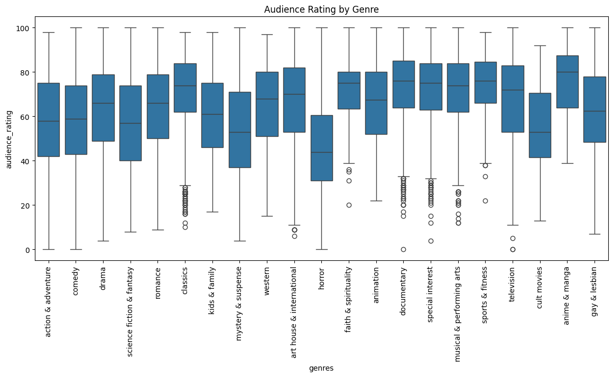
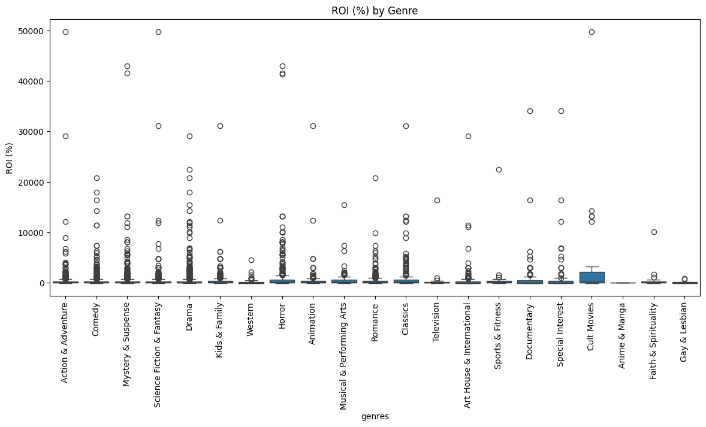
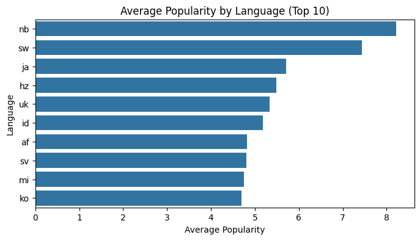
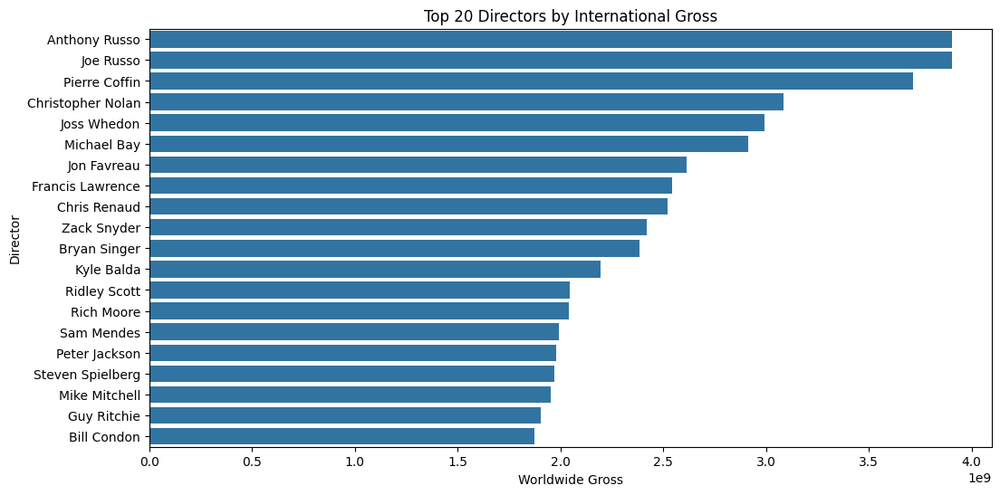

# FILM DATA ANALYSIS FOR SUCCESSFUL LAUNCH INTO THE INDUSTRY

 This project analyzes various film industry datasets to uncover trends that can guide a company's strategic entry into the entertainment industry. 
 Major corporations are increasingly investing in original content creation, our company is preparing to launch a movie studio to capitalize on the growing entertainment market. With limited prior experience in film production, this project is designed to deliver data-driven insights that will guide our entry into the industry.
 We will be analyzing comprehensive datasets from across the film ecosystem with the aim to uncover patterns of success. We will site genres,creators and markets that demonstrate high potential for prophitability and critical acclaim

# BUSINESS UNDERSTANDING
With streaming platforms, global cinema, and digital distribution evolving, film production has become both an art and a high-stakes business. Identifying what makes a movie successful requires analyzing box office numbers, critic reviews, audience preferences, and market performance.

This analysis will help answer the following key business questions:

   1. Which film genres receive the best critical reception?
   2. What genres offer the highest return on investment (ROI)?
   3. Which languages and production markets are most commonly associated with popular, high-grossing films?
   4. Are there directors whose films consistently perform well internationally?

These insights will equip the new studio team with reliable data to greenlight projects that align with market demand and maximize profitability.

# Data Sources
Kaggle: https://www.kaggle.com/datasets/stefanoleone992/rotten-tomatoes-movies-and-critic-reviews-dataset?resource=download

To generate reliable insights, we are going to integrate data from multiple authoratative sources. They include:

    Box Office Mojo: Gross earnings and box office performance.
    Rotten Tomatoes: Critic and audience scores, along with review sentiment.
    IMDb Links: Unique identifiers to cross-reference movies across datasets.
    TheMovieDB: Metadata on movies including genres, languages, production countries, popularity, and more.
    The Numbers: Financial details such as production budgets and revenues to help calculate ROI.

Together, these datasets offer a comprehensive view of the global film landscape.
 
#  Methodology: Collaborative Approach to Film Data Analysis
To maintain momentum and ensure parallel progress, each methodological stage of this project is collaboratively divided into four interdependent parts. This approach ensures that all group members remain engaged and contribute meaningfully across all stages — from exploration to business recommendations.
 Data Exploration
 
    This phase focuses on understanding the dataset, identifying important columns, and investigating potential relationships that could be explored.
    We assess the structure of the data, determine which columns are crucial for our analysis, and evaluate whether the data is clean or requires attention.
    Each member investigates different subsets of the data to understand the distribution, data types, and to identify any obvious issues (e.g., missing values, inconsistencies).
    The goal is to identify any initial patterns, issues, or opportunities for further exploration and to form hypotheses that guide the next steps in the analysis.
 2. Data Preparation & Cleaning
    After initial exploration, we focus on preparing the data for further analysis by accurately merging various datasets, ensuring that relationships are explored correctly.
    We handle any missing values through imputations, deal with outliers, and perform other cleaning tasks (e.g., removing duplicates, handling inconsistencies).
    The data is structured in a way that allows us to explore relationships in greater depth and ensures that the datasets are accurate, consistent, and ready for analysis.
    This stage ensures that the data is in a clean, usable state for modeling and deeper insights.

3. Data Analysis
This stage is divided into two complementary tracks, both of which are handled collaboratively and iteratively:
Data Visualization

    Group members explore visual trends related to genres, ratings, ROI, and other variables.
    Visualization types include bar plots, box plots, histograms, and scatter plots to surface patterns.
    Visual insights are cross-validated and shared among the team to refine hypotheses and interpretations.
 Hypothesis Testing
 
    Designed to statistically support or challenge the patterns observed in visual analysis.
    Each team member tests different assumptions using methods like t-tests and ANOVA.
    Focused on validating insights about genre success, director performance, and audience preferences.
4.Business Recommendations

    Synthesizing results into clear, actionable insights for the new movie studio.
    All team members collaborate to align recommendations with business goals.
    Focused on helping decision-makers prioritize genres, directors, languages, and film types based on profitability, audience reception, and global appeal.

# Key Visualizations
Below are the critical visualizations that helped provide insights into the film industry:
1. Understanding the Relationship between Genres and Ratings

2. Understanding the Relationship between Genre and ROI

3. Understanding the Relationship between Language and Popularity

4. Understanding the Relationship between Directors and Worldwide Gross Earnings

#  Conclusion
Our analysis shows that G-rated and family-friendly films offer the highest ROI, certain genres like Drama and Animation consistently receive strong ratings, and a few key directors drive higher foreign revenue. English remains the dominant language for popular films, but non-English content also shows potential. These insights can help guide data-driven decisions on genre focus, content rating, and director partnerships for a successful market entry.
 # Technologies Used
 
  Python - Pandas, Matplotlib, Seaborn, NumPy
   Jupyter Notebook
   #  Repository Structure
   
    ZippedData/ → Folder containing the cleaned datasets used in analysis
    scripts/ → Folder containing Script to automatically unzip ZippedData into Data Folder locally
    Data/ → Folder with unzipped data (ignored by Git due to .gitignore configuration)
    images/ → Folder containing images used throughout the notebook and README.md file
    README.md → This project overview file
    index.ipynb → Jupyter Notebook containing full analysis
    presentation.pdf → Group presentation for investor/stakeholder insights

 

# Tableau TABLEAU LINK
https://public.tableau.com/app/profile/rita.nyaga/viz/FilmDataAnalysisDashboard/Dashboard2?publish=yes

 
